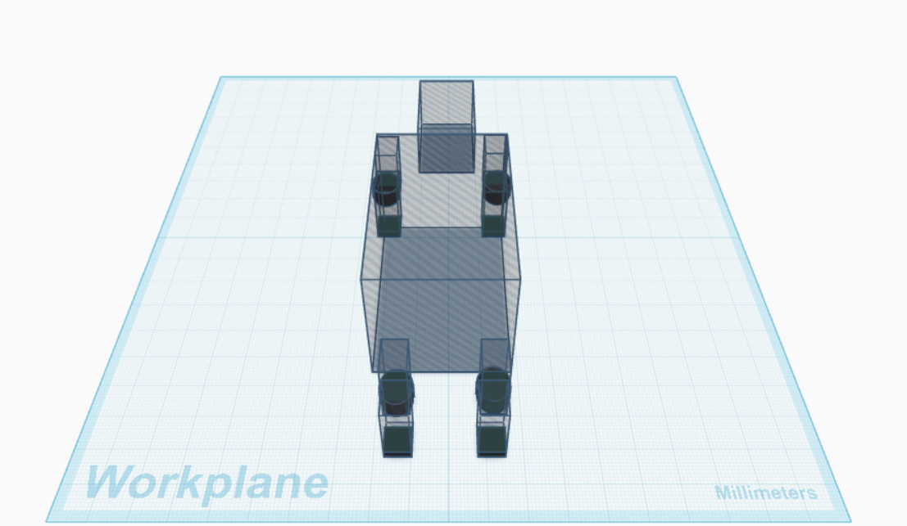

# 🐕 Robot Dog Mechanical Design

A preliminary mechanical design of a simple quadruped robot dog developed using **Tinkercad**. 

---

## 📷 Final Design



---

## 📌 Project Overview

This project presents the preliminary mechanical design of a simple four-legged robot dog. The main objective is to understand the fundamental mechanical concepts required for a quadruped robot, including body structure, leg design, joints, motor selection, stability, and walking mechanism. The design focuses on simplicity while demonstrating the basic principles of robotic mechanical systems.

---

## 🛠 Software Used

- Tinkercad

---

## 🎯 Project Objectives

- Design a simple robot dog chassis.
- Create a stable four-legged mechanical structure.
- Define the joints and Degrees of Freedom (DOF).
- Select an appropriate servo motor.
- Improve stability through proper weight distribution.
- Propose a simple walking gait.

---

## 🏗 Robot Structure

The robot consists of:

- Head
- Main body (Chassis)
- Four legs
- Hip joints
- Knee joints
- Feet

---

## ⚙ Mechanical Design

### Body

The body is designed as a rectangular chassis that provides a stable structure while allowing enough space for future electronic components such as the battery, controller, and sensors.

### Legs

The robot has four identical legs.

Each leg consists of:

- Upper Leg
- Lower Leg
- Foot

Each leg contains two joints:

- Hip Joint
- Knee Joint

---

## 🔄 Degrees of Freedom (DOF)

Each leg has:

- Hip Joint → 1 DOF
- Knee Joint → 1 DOF

**Total DOF = 8**

---

## 🔋 Motor Selection

**Recommended Servo Motor:** MG996R

Reasons:

- High torque
- Easy to control
- Affordable
- Commonly used in educational robotics projects

---

## ⚖ Stability

The legs are positioned near the four corners of the chassis to improve balance and stability. The center of gravity is intended to remain close to the center of the body, helping the robot maintain stability while standing and walking.

---

## 🚶 Proposed Walking Gait

The robot follows a simple walking sequence:

1. Front Left
2. Rear Right
3. Front Right
4. Rear Left

This gait improves stability because three legs remain in contact with the ground while one leg moves.

---

## ⚠ Expected Mechanical Challenges

- Joint friction
- Servo overload
- Foot slipping
- Balance during movement
- Weight distribution
- Mechanical vibration

---

## 📁 Project Files

```
Robot-Dog-Mechanical-Design/
│
├── README.md
├── RobotDog.stl
├── front.png
├── side.png
├── top.png
└── isometric.png
```

---

## 👩‍💻 Author

**Student:** Jana

**Course:** Mechanical Design Assignment

**Software:** Tinkercad
